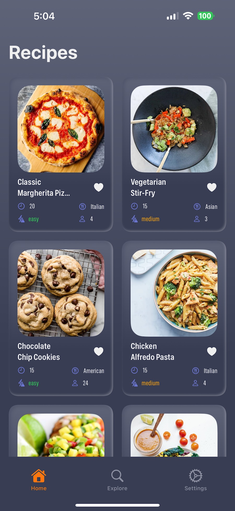
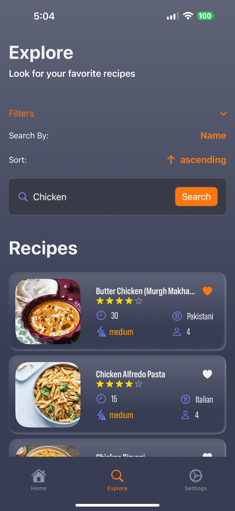
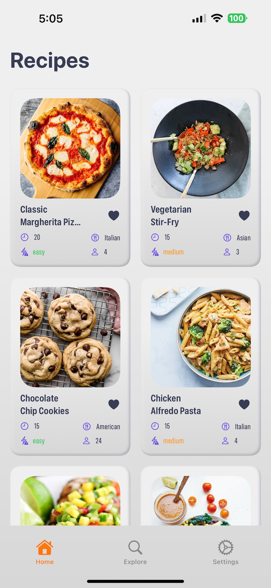
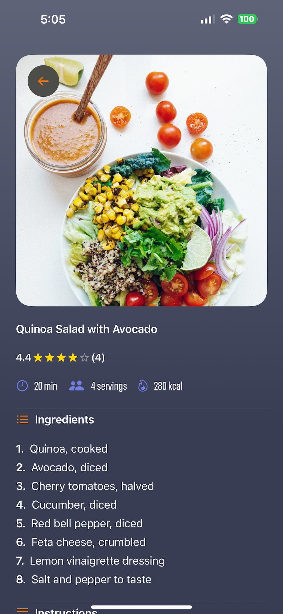

# 🍽️ Recipes Magic

Recipes Magic is a SwiftUI-based iOS application designed to allow users to browse and search for recipes using the [DummyJSON API](https://dummyjson.com/docs). The app follows the **MVVM architectural pattern**, implements structured concurrency for networking, and includes unit and UI tests.

## Table of Contents

- [App Overview](#app-overview)
- [Features](#features)
- [Networking](#networking)
- [Testing](#testing)
- [Bonus Features](#bonus-features)
- [Getting Started](#getting-started)
- [Running Tests](#running-tests)
- [Technologies Used](#technologies-used)
- [Future Enhancements](#future-enhancements)
- [Created By](#created-by)

## App Overview

### Features

1. **Project Setup**

   - Built with **SwiftUI** as the UI framework.
   - Follows the **MVVM (Model-View-ViewModel) architecture** for better separation of concerns.
   - Implements structured concurrency using **async/await** for networking.

2. **Fetch and Display a List of Recipes**

   - The app fetches a **list of recipes** from the **DummyJSON API**.
   - Displays recipes in a **grid layout**.
   - Supports **pagination** for loading more recipes dynamically.
   - Implements error handling for failed API requests.

3. **Item Detail View**

   - When a user taps a recipe, the app navigates to a **detailed view**.
   - The detail screen includes:
     - **Recipe name**
     - **High-resolution image**
     - **Long description**

## Networking

- The app **fetches data using async/await for structured concurrency.
- Uses a **dedicated HTTPClient** for network requests.
- Implements **error handling** to show alerts when network calls fail.

## Testing

### **Unit Tests**

- Implemented for the **networking layer** and **ViewModels**.
- Covers various failure scenarios (e.g., decoding errors, 400+ status responses).
- Tests **ViewModels** to verify correct data handling.

### **UI Tests**

- Uses `XCTest` to verify navigation and UI elements.
- Tests the flow **from the landing screen to home and recipe detail views**.

## Bonus Features

1. **Dependency Injection**: The **network service, and api service are injected** into ViewModels, making it testable and modular.
2. **Pull-to-Refresh**: Users can **swipe down** to refresh the recipe list.
3. **Pagination**: The app **fetches more recipes dynamically** when scrolling to the bottom.
4. **Search & Sorting**:
   - Users can **search recipes by name**.
   - Recipes can be **sorted alphabetically or by relevance**.
5. **UI Tests**: Implemented UI tests using `XCTest` to verify **screen elements, navigation, and actions**.
6. **Improved UI/UX**:
   - Includes **animations and gradients** for better user experience.
   - Uses **custom styling** for buttons and cards.

## Getting Started

### Prerequisites

- Xcode (Latest Version)
- iOS 16+ Simulator or Physical Device

### Installation

1. Clone the repository:
   ```bash
   git clone https://github.com/amer266030/Foodics_Recipes.git
   ```
2. Navigate to the project directory:
   ```bash
   cd FoodicsRecipes
   ```
3. Open `FoodicsRecipes.xcodeproj` in **Xcode**.
4. Select an **iPhone Simulator** and press **Cmd + R** to run the app.

## Running Tests

### **Unit Tests**

- Press `Cmd + U` in Xcode to run all **unit tests**.

### **UI Tests**

- Navigate to the **UI Test class** and run tests individually.

## Technologies Used

- **SwiftUI** – Declarative UI framework.
- **MVVM** – Clean architecture.
- **Async/Await** – Modern concurrency handling.
- **XCTest** – Unit and UI testing framework.
- **Swift Package Manager (SPM)** – Dependency management.
- **DummyJSON API** – Data source for recipes.

## Future Enhancements

- Add **favorites** functionality to save recipes.
- Implement **offline mode** using local storage.
- Improve **animations and transitions**.

## Created By

- **Amer Alyusuf**
- [GitHub](https://github.com/amer266030)
- [LinkedIn](https://www.linkedin.com/in/amer-alyusuf)

## App Screenshots





